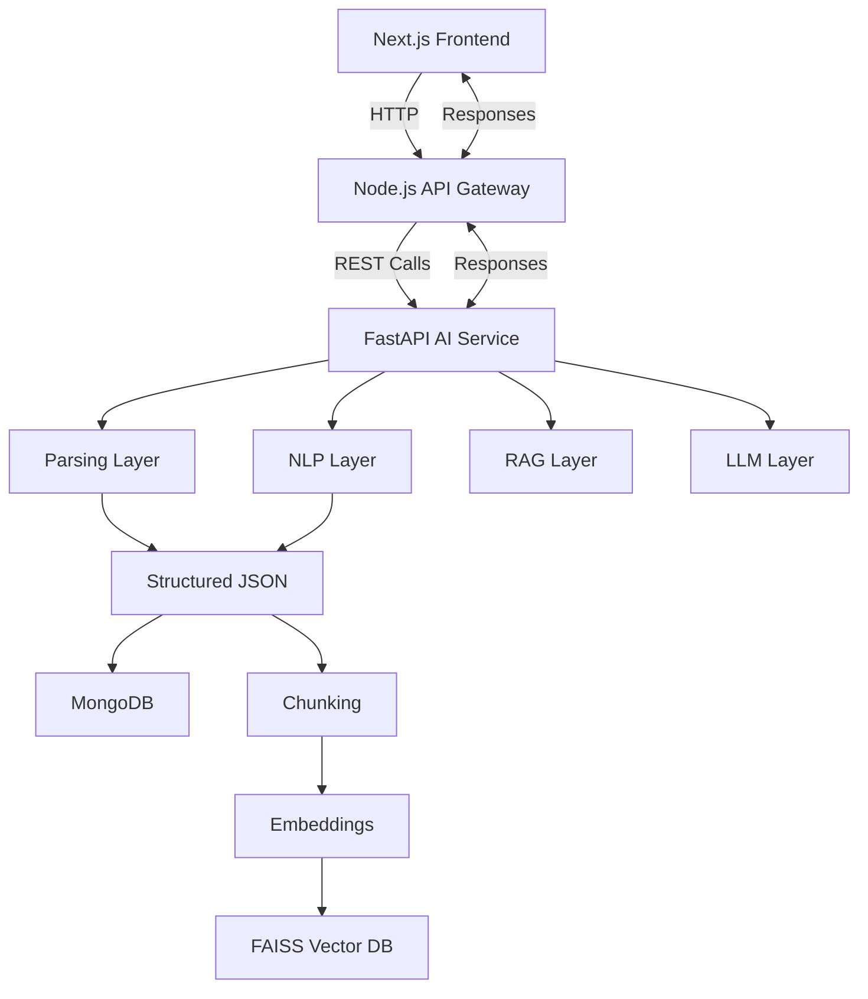
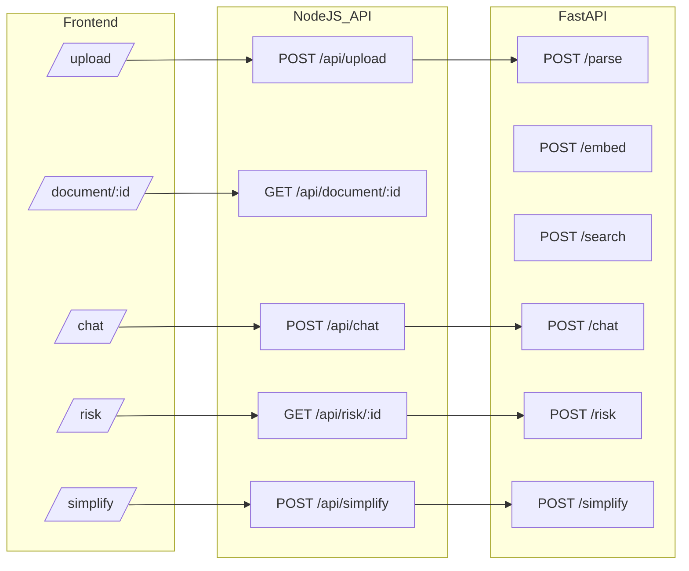
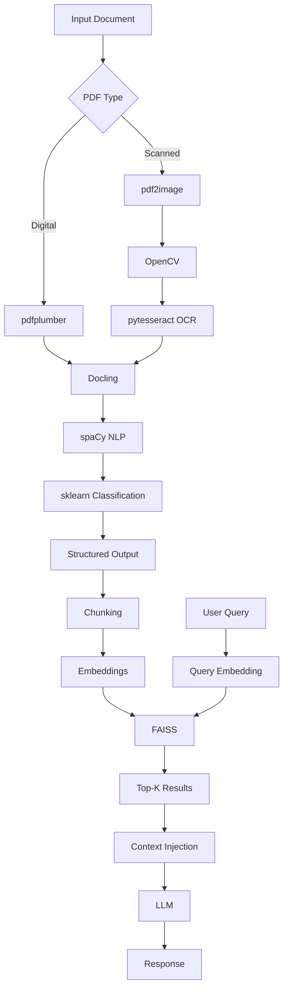
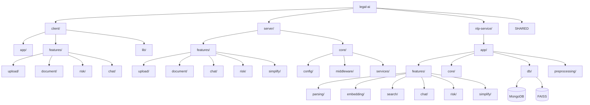
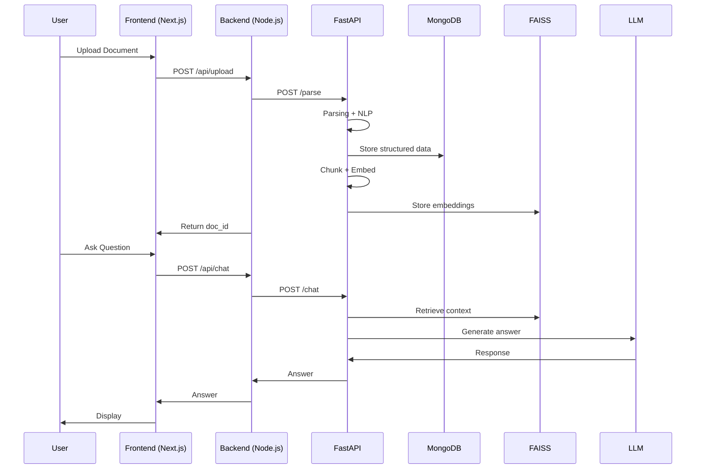
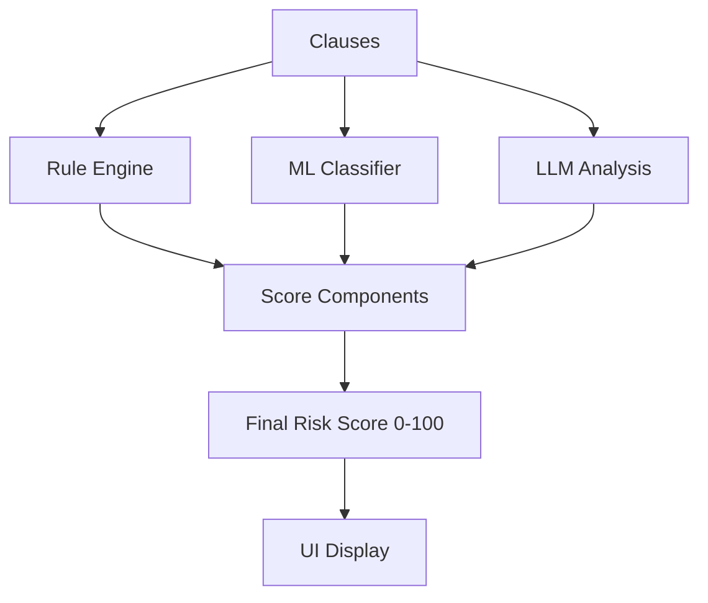

# Mermaid Architecture Diagram (Full System + API Routes + File Structure)

---

## 1. High-Level System Flow

---

## 2. API Routes Mapping

---

## 3. Parsing + NLP + RAG Pipeline

---

## 4. Project Folder Structure

---

## 5. End-to-End Execution Flow

---

## 6. Risk Engine Flow

---

## 7. Key System Properties

* Multi-layer pipeline (Parsing → NLP → RAG → LLM)
* Strict microservice separation
* Hybrid AI (deterministic + probabilistic)
* API-driven architecture
* Scalable and modular

---

## 8. Summary

This diagram set represents:

* Full request lifecycle
* API interactions
* Internal AI pipelines
* Project structure

System type:

* Document Intelligence Engine
* RAG-based Legal AI System
* Production-grade microservice architecture

---
